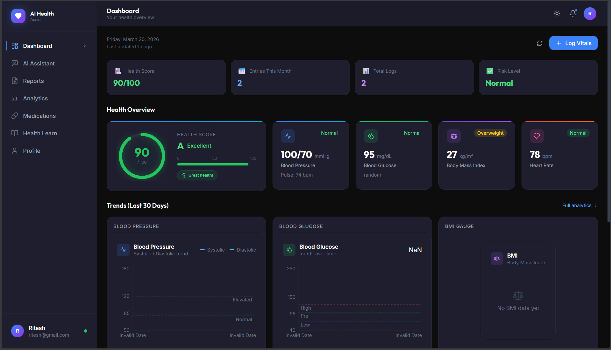
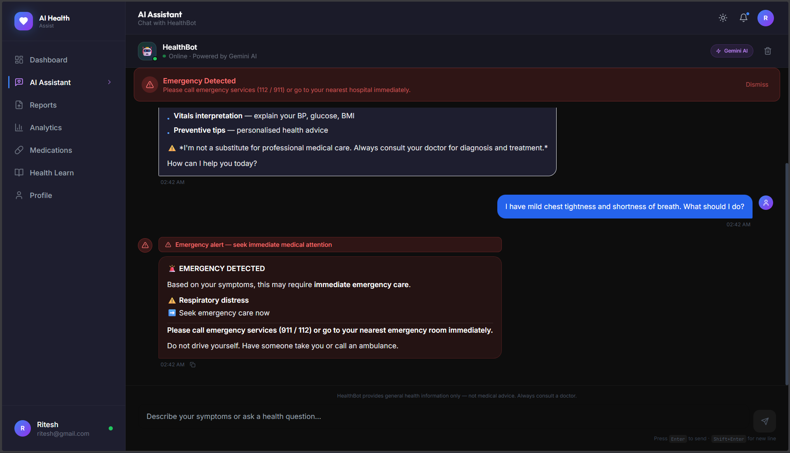
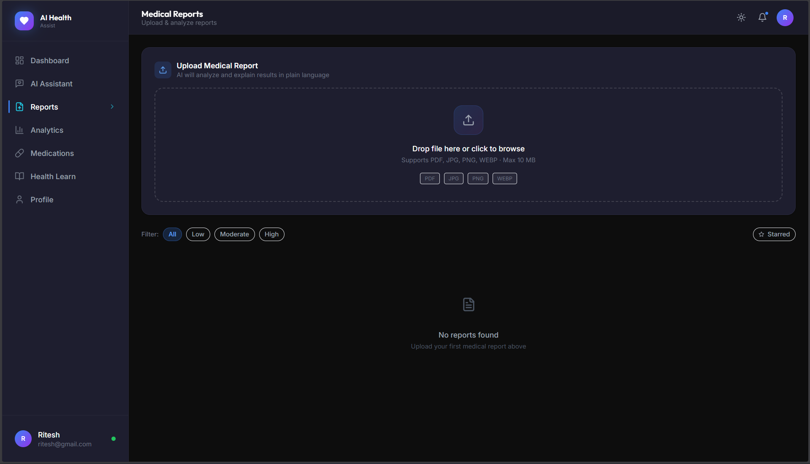
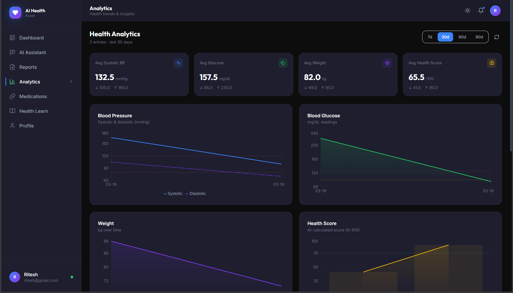
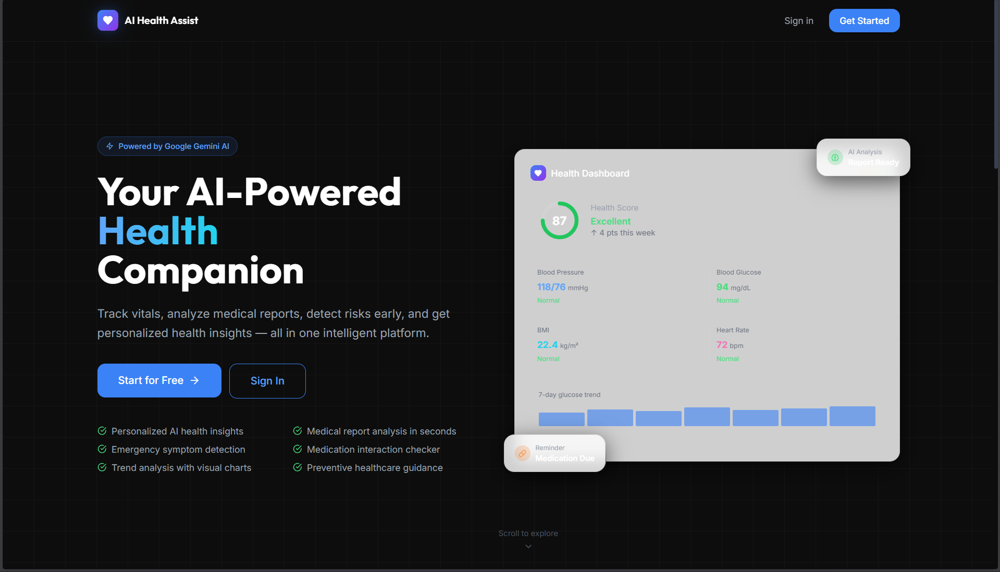
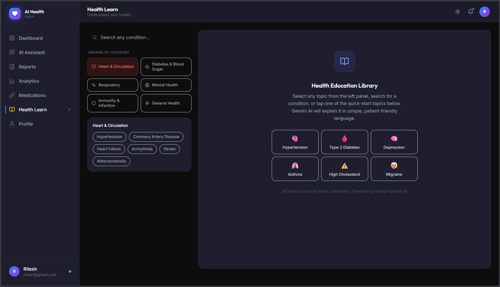

<div align="center">

<!-- BANNER IMAGE -->
<!-- 📸 Place your banner image at: assets/banner.png (recommended: 1280×640px) -->


<br/><br/>

<h1>
  
  &nbsp;AI Health Assist
</h1>

<p><strong>Your intelligent, AI-powered personal health companion</strong><br/>
Track vitals · Analyze medical reports · Detect risks early · Get personalized AI guidance</p>

<!-- BADGES ROW 1 -->
<p>
  <a href="https://github.com/riteshrana12-dev/ai-health-assist/stargazers">
    
  </a>
  <a href="https://github.com/riteshrana12-dev/ai-health-assist/network/members">
    
  </a>
  <a href="https://github.com/riteshrana12-dev/ai-health-assist/issues">
    
  </a>
  
</p>

<!-- BADGES ROW 2 -->
<p>
  
  
  
  
  
  
</p>

<!-- CTA BUTTONS -->
<br/>
<a href="https://ai-health-assist.vercel.app">
  
</a>
&nbsp;&nbsp;
<a href="https://github.com/riteshrana12-dev/ai-health-assist">
  
</a>

<br/><br/>

</div>

---

## 📸 Screenshots

| Dashboard | AI Chat Assistant |
|:---------:|:-----------------:|
|  |  |

| Medical Report Analyzer | Health Analytics |
|:-----------------------:|:----------------:|
|  |  |

| Landing Page | Health Education |
|:------------:|:----------------:|
|  |  |


## 📋 Table of Contents

- [✨ Features](#-features)
- [🏗️ Architecture](#️-architecture)
- [📁 Folder Structure](#-folder-structure)
- [🛠️ Tech Stack](#️-tech-stack)
- [📦 Dependencies](#-dependencies)
- [⚡ Quick Start](#-quick-start)
- [🔑 Environment Variables](#-environment-variables)
- [📡 API Reference](#-api-reference)
- [🗂️ Database Models](#️-database-models)
- [🚀 Deployment](#-deployment)
- [🐛 Troubleshooting](#-troubleshooting)
- [🤝 Contributing](#-contributing)

---

## ✨ Features

<table>
<tr>
<td width="50%">

### 🤖 AI-Powered Features
- **AI Health Chatbot** — Symptom checker powered by Google Gemini 1.5 Flash with conversation history and emergency detection
- **Medical Report Analyzer** — Upload PDF/images; AI explains results in plain patient-friendly language instantly
- **Risk Prediction Engine** — Full cardiovascular, diabetes & metabolic risk assessment
- **Smart Insights** — 3 personalized AI health tips generated from your vitals trend
- **Health Education Library** — AI explains 36+ diseases across 6 categories

</td>
<td width="50%">

### 📊 Health Tracking
- **Health Dashboard** — BMI, blood pressure, glucose, heart rate in one view
- **AI Health Score** — Composite 0–100 score with grade A–F and breakdown
- **Trend Analytics** — 7/30/60/90-day animated charts for all vitals
- **Medication Tracker** — Schedule, adherence logging, dose reminders
- **Patient Profile** — Medical history, allergies, lifestyle, emergency contacts

</td>
</tr>
</table>

<details>
<summary><strong>🔍 View complete feature list</strong></summary>

<br/>

| Feature | Details |
|---------|---------|
| 🔐 JWT Auth | Secure register/login, bcrypt password hashing, token refresh |
| 📄 Report Upload | Drag-drop PDF/image with progress bar, Cloudinary CDN |
| 🧬 OCR + Vision | PDF text extraction + Gemini vision API for image reports |
| 💊 Drug Interaction Checker | AI checks your active medications for dangerous interactions |
| 📈 Recharts Visualizations | Animated line, area, bar, radial charts for all health metrics |
| 🌙 Dark / Light Mode | System preference detection + manual toggle, persisted to localStorage |
| 📱 Fully Responsive | Mobile-first, sidebar drawer on mobile, works on all screen sizes |
| 🔔 Medication Reminders | node-cron hourly scheduler with adherence rate tracking |
| 🚨 Emergency Detection | Instant red alert banner when critical symptoms are detected in chat |
| ⚡ Health Score Engine | BMI + BP + Glucose + Lifestyle composite scoring algorithm |
| 🔄 Auto-polling | Reports page auto-polls every 4s until AI analysis completes |
| 🛡️ Rate Limiting | Global 100 req/15min, AI routes 15 req/min, Auth routes 20 req/15min |

</details>

---

## 🏗️ Architecture

```
┌──────────────────────────────────────────────────────────────────┐
│                        CLIENT LAYER                               │
│         React 18 + Vite 5 + Tailwind CSS + Framer Motion         │
│                                                                   │
│  Landing  Login  Dashboard  Chat  Reports  Analytics  Profile     │
│  Signup   HealthEducation   Medications                           │
└─────────────────────────┬────────────────────────────────────────┘
                          │  HTTPS  /  JWT Bearer Token
┌─────────────────────────▼────────────────────────────────────────┐
│              API GATEWAY  —  Express.js + JWT Middleware          │
│        Helmet  ·  CORS  ·  Rate Limiting  ·  Morgan Logger       │
└──────┬────────────┬────────────┬──────────────┬──────────────────┘
       │            │            │              │
  ┌────▼───┐  ┌────▼────┐  ┌───▼────┐   ┌────▼──────────┐
  │  Auth  │  │ Health  │  │  AI    │   │ Reports  Meds │
  │  Svc   │  │  Data   │  │  Chat  │   │ Controllers   │
  └────┬───┘  └────┬────┘  └───┬────┘   └────┬──────────┘
       │            │            │              │
┌──────▼────────────▼────────────▼──────────────▼──────────────────┐
│                    DATA  &  SERVICES  LAYER                        │
├──────────────────┬─────────────────────┬────────────────────────┤
│   MongoDB Atlas  │   Google Gemini AI  │    Cloudinary CDN      │
│  User · Health   │   Chatbot · Analyze │  PDF + Image Storage   │
│  Report · Meds   │   Risk · Explain    │  Avatar Uploads        │
└──────────────────┴─────────────────────┴────────────────────────┘
┌──────────────────────────────────────────────────────────────────┐
│                        DEPLOYMENT                                  │
│     Vercel (Frontend)  ·  Render (Backend)  ·  Atlas (Database)  │
└──────────────────────────────────────────────────────────────────┘
```

---

## 📁 Folder Structure

```
ai-health-assist/
│
├── 📁 assets/                        ← 🖼️  YOUR SCREENSHOTS & VIDEO GO HERE
│   ├── banner.png
│   ├── dashboard.png
│   ├── chat.png
│   ├── reports.png
│   ├── analytics.png
│   ├── landing.png
│   ├── education.png
│   ├── demo-thumbnail.png
│   └── demo.mp4
│
├── 📁 client/                        ← React + Vite Frontend
│   ├── public/
│   │   └── favicon.svg
│   ├── src/
│   │   ├── 📁 components/            ← 18 reusable components
│   │   │   ├── charts/               ← BPChart · GlucoseChart · BMIGauge · TrendChart
│   │   │   ├── chat/                 ← MessageBubble · TypingIndicator
│   │   │   ├── common/               ← Sidebar · Navbar · DashboardLayout · ProtectedRoute
│   │   │   ├── dashboard/            ← HealthScoreCard · VitalsGrid · LogVitalsModal
│   │   │   └── reports/              ← UploadZone · ReportCard · AIExplanation
│   │   ├── 📁 context/
│   │   │   ├── AuthContext.jsx       ← JWT auth state (useReducer pattern)
│   │   │   └── ThemeContext.jsx      ← Dark/light mode with system preference
│   │   ├── 📁 hooks/
│   │   │   ├── useAuth.js
│   │   │   ├── useHealth.js          ← Dashboard & vitals state management
│   │   │   └── useChat.js            ← Chat messages & emergency state
│   │   ├── 📁 pages/                 ← 10 Pages
│   │   │   ├── Landing.jsx           ← Hero, features, stats, CTA
│   │   │   ├── Login.jsx             ← JWT login with demo credentials
│   │   │   ├── Signup.jsx            ← 2-step registration with health profile
│   │   │   ├── Dashboard.jsx         ← Main health overview
│   │   │   ├── ChatAssistant.jsx     ← Full AI chat with quick prompts
│   │   │   ├── UploadReport.jsx      ← Drag-drop + AI analysis panel
│   │   │   ├── Analytics.jsx         ← 6 Recharts + AI risk assessment
│   │   │   ├── Profile.jsx           ← Full medical profile editor
│   │   │   ├── Medications.jsx       ← CRUD + adherence tracking
│   │   │   └── HealthEducation.jsx   ← AI-powered disease library
│   │   ├── 📁 services/              ← Axios API layer (JWT interceptor)
│   │   │   ├── api.js                ← Axios instance + 401 auto-redirect
│   │   │   ├── authService.js
│   │   │   ├── healthService.js
│   │   │   ├── chatService.js
│   │   │   ├── reportService.js
│   │   │   └── medicationService.js
│   │   ├── 📁 utils/
│   │   │   └── formatters.js         ← Date, BMI, BP, glucose, chart color helpers
│   │   ├── App.jsx                   ← Router + lazy loading + providers
│   │   ├── main.jsx
│   │   └── index.css                 ← Design system CSS variables + glassmorphism
│   ├── tailwind.config.js            ← Custom colors, animations, shadows
│   ├── vite.config.js                ← API proxy + code splitting
│   ├── vercel.json                   ← SPA routing + cache headers
│   └── package.json
│
├── 📁 server/                        ← Node.js + Express Backend
│   ├── 📁 config/
│   │   ├── db.js                     ← MongoDB Atlas connection
│   │   └── cloudinary.js             ← Cloudinary SDK setup
│   ├── 📁 controllers/               ← 5 controllers, ~1200 lines
│   │   ├── authController.js         ← Register, login, profile CRUD
│   │   ├── healthController.js       ← Log vitals, dashboard, analytics
│   │   ├── chatController.js         ← 8 AI endpoints
│   │   ├── reportController.js       ← Upload, analyze, list, delete
│   │   └── medicationController.js   ← CRUD + dose logging
│   ├── 📁 middleware/
│   │   ├── authMiddleware.js         ← JWT verify + protect route guard
│   │   ├── errorHandler.js           ← Global error handler + AppError class
│   │   └── uploadMiddleware.js       ← Multer + Cloudinary stream upload
│   ├── 📁 models/                    ← 4 Mongoose schemas
│   │   ├── User.js                   ← Full medical profile schema
│   │   ├── HealthData.js             ← Vitals + AI health score
│   │   ├── Report.js                 ← File metadata + AI analysis
│   │   └── Medication.js             ← Schedule + adherence tracking
│   ├── 📁 routes/                    ← 5 route files
│   │   ├── auth.js  health.js  chat.js  reports.js  medications.js
│   ├── 📁 services/                  ← AI & business logic
│   │   ├── geminiService.js          ← Chatbot · Analyzer · Risk · Education
│   │   ├── healthScoreService.js     ← Dashboard insights wrapper
│   │   └── riskPredictionService.js  ← Risk orchestrator + emergency matcher
│   ├── 📁 utils/
│   │   ├── generateToken.js          ← JWT sign + sendTokenResponse helper
│   │   └── healthCalculators.js      ← BMI, BP, glucose, health score calculators
│   ├── server.js                     ← Express app, routes, cron, graceful shutdown
│   └── package.json
│
├── render.yaml                       ← Render.com backend config
├── .gitignore
└── README.md
```

---

## 🛠️ Tech Stack

<table>
<thead>
<tr>
<th>Layer</th>
<th>Technology</th>
<th>Version</th>
<th>Purpose</th>
</tr>
</thead>
<tbody>
<tr>
<td rowspan="6"><strong>Frontend</strong></td>
<td></td>
<td>18.2</td>
<td>UI library — hooks, context, lazy loading</td>
</tr>
<tr>
<td></td>
<td>5.1</td>
<td>Build tool — HMR, code splitting, proxy</td>
</tr>
<tr>
<td></td>
<td>3.4</td>
<td>Utility CSS — dark mode, glassmorphism</td>
</tr>
<tr>
<td></td>
<td>11.0</td>
<td>Animations, page transitions, spring physics</td>
</tr>
<tr>
<td></td>
<td>2.12</td>
<td>Health charts — line, area, bar, radial</td>
</tr>
<tr>
<td></td>
<td>6.22</td>
<td>Client-side routing + protected routes</td>
</tr>
<tr>
<td rowspan="5"><strong>Backend</strong></td>
<td></td>
<td>18+</td>
<td>JavaScript runtime</td>
</tr>
<tr>
<td></td>
<td>4.18</td>
<td>REST API framework</td>
</tr>
<tr>
<td></td>
<td>9.0</td>
<td>Stateless auth tokens</td>
</tr>
<tr>
<td></td>
<td>2.4</td>
<td>Password hashing (salt rounds: 12)</td>
</tr>
<tr>
<td></td>
<td>1.4</td>
<td>File upload + memory storage</td>
</tr>
<tr>
<td><strong>Database</strong></td>
<td></td>
<td>8.2 (Mongoose)</td>
<td>Cloud NoSQL — 4 collections, ODM with virtual fields</td>
</tr>
<tr>
<td><strong>AI</strong></td>
<td></td>
<td>1.5 Flash</td>
<td>Chat · Report analysis · Risk prediction · Education</td>
</tr>
<tr>
<td><strong>Storage</strong></td>
<td></td>
<td>2.0</td>
<td>PDF & image CDN — stream upload via Multer</td>
</tr>
<tr>
<td rowspan="2"><strong>Deployment</strong></td>
<td></td>
<td>—</td>
<td>Frontend — SPA routing, CDN, auto HTTPS</td>
</tr>
<tr>
<td></td>
<td>—</td>
<td>Backend — free tier, auto-deploy from GitHub</td>
</tr>
</tbody>
</table>

---

## 📦 Dependencies

<details>
<summary><strong>📦 Frontend — client/package.json</strong></summary>

<br/>

| Package | Version | Purpose |
|---------|---------|---------|
| `react` | ^18.2.0 | UI library |
| `react-dom` | ^18.2.0 | DOM rendering |
| `react-router-dom` | ^6.22.2 | Client routing |
| `framer-motion` | ^11.0.5 | Animations |
| `recharts` | ^2.12.0 | Charts |
| `axios` | ^1.6.7 | HTTP client with interceptors |
| `react-hot-toast` | ^2.4.1 | Toast notifications |
| `lucide-react` | ^0.344.0 | Icon library |
| **Dev** | | |
| `tailwindcss` | ^3.4.1 | CSS framework |
| `vite` | ^5.1.4 | Build tool |
| `@vitejs/plugin-react` | ^4.2.1 | Vite plugin |
| `postcss` | ^8.4.35 | CSS processing |
| `autoprefixer` | ^10.4.17 | CSS vendor prefixes |

</details>

<details>
<summary><strong>📦 Backend — server/package.json</strong></summary>

<br/>

| Package | Version | Purpose |
|---------|---------|---------|
| `express` | ^4.18.2 | Web framework |
| `mongoose` | ^8.2.0 | MongoDB ODM |
| `@google/generative-ai` | ^0.2.1 | Gemini AI SDK |
| `bcryptjs` | ^2.4.3 | Password hashing |
| `jsonwebtoken` | ^9.0.2 | JWT sign & verify |
| `cloudinary` | ^2.0.1 | Cloud file storage |
| `multer` | ^1.4.5-lts.1 | File upload middleware |
| `multer-storage-cloudinary` | ^4.0.0 | Cloudinary multer adapter |
| `pdf-parse` | ^1.1.1 | PDF text extraction |
| `streamifier` | ^0.1.1 | Buffer → stream for Cloudinary |
| `express-rate-limit` | ^7.2.0 | API rate limiting |
| `express-validator` | ^7.0.1 | Request validation |
| `helmet` | ^7.1.0 | Security HTTP headers |
| `cors` | ^2.8.5 | Cross-origin request handling |
| `morgan` | ^1.10.0 | HTTP request logger |
| `node-cron` | ^3.0.3 | Medication reminder scheduler |
| `dotenv` | ^16.4.5 | Environment variable loader |
| **Dev** | | |
| `nodemon` | ^3.1.0 | Auto-restart on file changes |

</details>

---

## ⚡ Quick Start

### Prerequisites

```bash
node --version    # v18.0.0 or higher required
npm --version     # v9.0.0 or higher
```

You will also need **free accounts** on:

| Service | Sign up | Purpose |
|---------|---------|---------|
| MongoDB Atlas | [cloud.mongodb.com](https://cloud.mongodb.com) | Database |
| Google AI Studio | [makersuite.google.com](https://makersuite.google.com/app/apikey) | Gemini API Key |
| Cloudinary | [cloudinary.com](https://cloudinary.com) | File storage |

---

### Step 1 — Clone

```bash
git clone https://github.com/riteshrana12-dev/ai-health-assist.git
cd ai-health-assist
```

---

### Step 2 — Backend Setup

```bash
cd server
npm install
cp .env.example .env
```

Edit `server/.env` and fill in your values (see [Environment Variables](#-environment-variables) below):

```bash
# Start development server
npm run dev
```

```
✅  MongoDB Connected: cluster0.xxxxx.mongodb.net
✅  Server running on port 5000
🔗  Health check: http://localhost:5000/api/health
```

---

### Step 3 — Frontend Setup

Open a **new terminal** in the project root:

```bash
cd client
npm install
cp .env.example .env
```

Edit `client/.env`:
```env
VITE_API_URL=http://localhost:5000/api
```

```bash
# Start development server
npm run dev
```

```
✅  VITE v5.1.4 ready
🌐  Local: http://localhost:5173
```

---

### Step 4 — Open the app

| | URL |
|-|-----|
| 🌐 App | http://localhost:5173 |
| 🔗 API | http://localhost:5000/api/health |

> **Demo account** — Register with any email, or use the pre-seeded demo:
> ```
> Email:    demo@aihealth.com
> Password: demo1234
> ```

---

## 🔑 Environment Variables

### Server — `server/.env`

```env
# ── Server ────────────────────────────────────
PORT=5000
NODE_ENV=development

# ── MongoDB Atlas ─────────────────────────────
# Get from: cloud.mongodb.com → Connect → Drivers → Node.js
MONGODB_URI=mongodb+srv://<username>:<password>@cluster0.xxxxx.mongodb.net/ai-health-assist?retryWrites=true&w=majority

# ── JWT Auth ──────────────────────────────────
# Generate: node -e "console.log(require('crypto').randomBytes(64).toString('hex'))"
JWT_SECRET=your_minimum_64_character_random_secret_string_here
JWT_EXPIRES_IN=7d

# ── Google Gemini AI ──────────────────────────
# Get from: makersuite.google.com/app/apikey (free)
GEMINI_API_KEY=AIzaSy_your_key_here
GEMINI_MODEL=gemini-1.5-flash

# ── Cloudinary ────────────────────────────────
# Get from: cloudinary.com → Dashboard
CLOUDINARY_CLOUD_NAME=your_cloud_name
CLOUDINARY_API_KEY=123456789012345
CLOUDINARY_API_SECRET=your_api_secret_here

# ── CORS ──────────────────────────────────────
CLIENT_URL=http://localhost:5173

# ── Rate Limiting (optional) ──────────────────
RATE_LIMIT_WINDOW_MS=900000
RATE_LIMIT_MAX_REQUESTS=100
```

### Client — `client/.env`

```env
VITE_API_URL=http://localhost:5000/api
VITE_APP_NAME=AI Health Assist
```

---

## 📡 API Reference

### 🔐 Auth — `/api/auth`

| Method | Endpoint | Description | Auth |
|--------|----------|-------------|------|
| `POST` | `/register` | Register new user | Public |
| `POST` | `/login` | Login — returns JWT | Public |
| `GET` | `/profile` | Get current user | 🔒 |
| `PUT` | `/profile` | Update profile | 🔒 |
| `POST` | `/profile/avatar` | Upload avatar | 🔒 |
| `PUT` | `/change-password` | Change password | 🔒 |
| `DELETE` | `/account` | Deactivate account | 🔒 |

### 📊 Health Data — `/api/health-data`

| Method | Endpoint | Description | Auth |
|--------|----------|-------------|------|
| `POST` | `/` | Log vitals entry | 🔒 |
| `GET` | `/dashboard` | Summary + trends | 🔒 |
| `GET` | `/analytics?days=30` | Chart series data | 🔒 |
| `GET` | `/history?page=1` | Paginated history | 🔒 |
| `GET` | `/:id` | Single entry | 🔒 |
| `DELETE` | `/:id` | Delete entry | 🔒 |

### 🤖 AI Chat — `/api/chat`

| Method | Endpoint | Description | Auth |
|--------|----------|-------------|------|
| `POST` | `/message` | Send chat message | 🔒 |
| `GET` | `/history` | Conversation history | 🔒 |
| `DELETE` | `/history` | Clear conversation | 🔒 |
| `GET` | `/insights` | Dashboard AI insights | 🔒 |
| `POST` | `/risk-predict` | Full risk assessment | 🔒 |
| `POST` | `/explain` | Explain a condition | 🔒 |
| `POST` | `/med-interactions` | Drug interaction check | 🔒 |
| `POST` | `/emergency-check` | Instant emergency detection | 🔒 |

### 📄 Reports — `/api/reports`

| Method | Endpoint | Description | Auth |
|--------|----------|-------------|------|
| `POST` | `/upload` | Upload + trigger AI | 🔒 |
| `GET` | `/` | List (filterable) | 🔒 |
| `GET` | `/:id` | Single report | 🔒 |
| `DELETE` | `/:id` | Delete | 🔒 |
| `PATCH` | `/:id/star` | Toggle star | 🔒 |
| `POST` | `/:id/analyze` | Re-run AI analysis | 🔒 |

### 💊 Medications — `/api/medications`

| Method | Endpoint | Description | Auth |
|--------|----------|-------------|------|
| `POST` | `/` | Add medication | 🔒 |
| `GET` | `/` | List all | 🔒 |
| `GET` | `/today` | Today's schedule | 🔒 |
| `PUT` | `/:id` | Update | 🔒 |
| `DELETE` | `/:id` | Delete | 🔒 |
| `POST` | `/:id/log` | Log dose (taken/missed/skipped) | 🔒 |

---

## 🗂️ Database Models

<details>
<summary><strong>User</strong></summary>

```
name · email · password (bcrypt hashed, hidden)
profilePic · age · gender · phone · bloodGroup
height { value, unit } · weight { value, unit }
allergies[] · medicalHistory[] · currentMedications[]
emergencyContact { name, relationship, phone }
lifestyle { smokingStatus, alcoholConsumption, exerciseFrequency, sleepHours }
settings { theme, notifications, units }
isActive · lastLogin · latestHealthScore · totalReports
```
</details>

<details>
<summary><strong>HealthData</strong></summary>

```
userId (ref: User)
bloodPressure { systolic, diastolic, pulse, category* }
glucose { value, unit, mealState, category* }
bmi { value*, category* }   ← * auto-calculated on save
weight · height
vitals { heartRate, oxygenSaturation, temperature }
labValues { cholesterol, HbA1c, hemoglobin, ... }
healthScore { overall, grade, breakdown, aiInsights }
riskFlags[] · entryType · notes · logDate
```
</details>

<details>
<summary><strong>Report</strong></summary>

```
userId (ref: User)
fileName · fileType · fileSize · fileUrl · cloudinaryPublicId
processingStatus (uploaded | analyzing | completed | failed)
extractedData { rawText, extractionMethod }
aiAnalysis {
  summary · reportType · riskLevel · confidenceScore
  keyFindings [{ parameter, value, normalRange, status, explanation }]
  recommendations[] · urgentFlags[] · preventiveSuggestions[]
}
isStarred · viewCount · tags[]
```
</details>

<details>
<summary><strong>Medication</strong></summary>

```
userId (ref: User)
name · genericName · category · color · purpose
dosage { amount, unit, form }
schedule { frequency, times[], withMeal }
startDate · endDate · isOngoing
adherenceLogs [{ scheduledTime, takenAt, status }]
adherenceRate* (auto-calculated on save)
refillInfo · reminders · prescribedBy · sideEffects[]
```
</details>

---

## 🚀 Deployment

### Frontend → Vercel

```bash
cd client
npm run build          # creates dist/ folder

# Option A: Vercel CLI
npx vercel --prod

# Option B: Connect GitHub repo at vercel.com
# Vercel auto-detects Vite and deploys on every push
```

**Add environment variable in Vercel dashboard:**
```
VITE_API_URL = https://your-api-name.onrender.com/api
```

The included `client/vercel.json` handles SPA routing automatically.

---

### Backend → Render

1. Push code to GitHub
2. Go to [render.com](https://render.com) → **New → Web Service**
3. Connect your GitHub repo

| Setting | Value |
|---------|-------|
| Root Directory | `server` |
| Build Command | `npm install` |
| Start Command | `node server.js` |
| Node Version | `18` |

4. Add all environment variables from `server/.env.example`
5. Deploy — Render auto-deploys on every `git push`

---

### MongoDB Atlas

```
1. cloud.mongodb.com → Create free M0 cluster
2. Database Access → Add database user (read/write)
3. Network Access → Add IP Address → 0.0.0.0/0
   (allows connections from Render's dynamic IPs)
4. Connect → Drivers → Node.js → copy connection string
5. Replace <password> with your actual password
6. Paste into MONGODB_URI environment variable
```

---

### Post-deployment CORS fix

After deploying frontend to Vercel, update `CLIENT_URL` in your Render environment:
```
CLIENT_URL = https://your-app-name.vercel.app
```

---

## 🐛 Troubleshooting

<details>
<summary><strong>"next is not a function" error on Mongoose save</strong></summary>

This happens in **Mongoose 8.x** when using callback-style pre-save hooks with `async`. All pre-save hooks must use the async pattern **without** a `next` parameter:

```js
// ✅ Correct — Mongoose resolves via the returned Promise
schema.pre('save', async function () {
  // your logic
})

// ❌ Wrong — crashes in Mongoose 8 with async functions
schema.pre('save', async function (next) {
  // your logic
  next()
})
```
</details>

<details>
<summary><strong>AI chat / education not working</strong></summary>

1. Check `GEMINI_API_KEY` is set in `server/.env`
2. Verify the key is active at [makersuite.google.com](https://makersuite.google.com/app/apikey)
3. Check server console for error messages
4. Free tier has rate limits — wait a moment and retry
</details>

<details>
<summary><strong>File upload fails (reports page)</strong></summary>

Verify all three Cloudinary values in `server/.env`:
- `CLOUDINARY_CLOUD_NAME`
- `CLOUDINARY_API_KEY`
- `CLOUDINARY_API_SECRET`

All three are required. Find them in your [Cloudinary dashboard](https://cloudinary.com/console).
</details>

<details>
<summary><strong>CORS errors in production</strong></summary>

In your Render backend environment variables, set:
```
CLIENT_URL = https://your-exact-vercel-url.vercel.app
```
No trailing slash. Must match exactly.
</details>

<details>
<summary><strong>MongoDB connection fails</strong></summary>

1. Check your IP is whitelisted (use `0.0.0.0/0` for Render)
2. Verify the `<password>` in MONGODB_URI is URL-encoded (special chars like `@` should be `%40`)
3. Ensure the cluster is running in MongoDB Atlas
</details>

---

## 🤝 Contributing

Contributions, issues and feature requests are welcome!

```bash
# Fork → Clone → Branch → Code → Commit → PR

git checkout -b feat/your-feature
git commit -m "feat: add amazing feature"
git push origin feat/your-feature
# Open a Pull Request on GitHub
```

**Commit convention:**

| Prefix | Use for |
|--------|---------|
| `feat:` | New feature |
| `fix:` | Bug fix |
| `docs:` | Documentation |
| `style:` | UI/CSS changes |
| `refactor:` | Code refactoring |
| `chore:` | Config/build changes |

---

## ⚠️ Disclaimer

> **AI Health Assist is for educational and informational purposes only.** It is not a substitute for professional medical advice, diagnosis, or treatment. Always consult a qualified healthcare provider regarding any medical condition.

---

<div align="center">

<br/>

**Built with ❤️ by [Ritesh Rana](https://github.com/riteshrana12-dev)**

<br/>

<a href="https://github.com/riteshrana12-dev/ai-health-assist">
  
</a>
&nbsp;
<a href="https://github.com/riteshrana12-dev/ai-health-assist/issues/new">
  
</a>
&nbsp;
<a href="https://github.com/riteshrana12-dev/ai-health-assist/issues/new">
  
</a>

<br/><br/>


<br/><br/>

*If this project helped you, please give it a ⭐ — it means a lot!*

</div>
